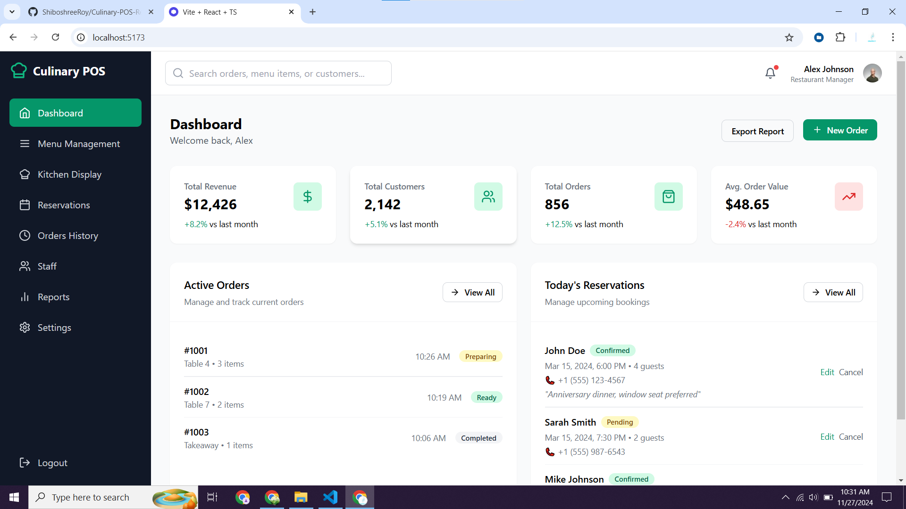

# 🍽️ Culinary POS Restaurant Website Dashboard

A modern restaurant management system built with **Vite**, **React**, and **TypeScript**, featuring POS integration for seamless restaurant operations.

---

## 🚀 Features

- **Dashboard**: Monitor daily operations and view detailed analytics.
- **Menu Management**: Add, update, or delete menu items with ease.
- **Order Management**: Handle dine-in, takeaway, and delivery orders.
- **POS Integration**: Process payments and generate receipts using POS devices.
- **Reservation System**: Allow customers to book tables online.
- **Inventory Management**: Track stock levels and set alerts for low inventory.
- **Staff Management**: Manage roles, schedules, and working hours.
- **Reports & Analytics**: Visualize sales trends and gain actionable insights.

---

## 🛠️ Technologies Used

- **Frontend**: Vite + React + TypeScript
- **Styling**: Tailwind CSS
- **Backend**: Node.js (Express.js)
- **Database**: MongoDB
- **POS Integration**: Square API

---

## 📷 Screenshots

### 1. **Dashboard Overview**


### 2. **Menu Management**


### 3. **POS Payment Page**


### 4. **Reservations Page**


---

## 📦 Installation

### Clone the Repository
```bash
git clone https://github.com/ShiboshreeRoy/Culinary-POS-Restaurant-Website-Dashbord.git
cd Culinary-POS-Restaurant-Website-Dashbord
```

### Install Dependencies
```bash
npm install
```

---

## 🛠️ Development

### Start the Project
1. Run the development server:
   ```bash
   npm run dev
   ```
2. Open your browser and navigate to:
   ```
   http://localhost:5173
   ```

---

## 🌟 Project Structure

```plaintext
Culinary-POS-Restaurant-Website-Dashbord/
├── public/         # Static assets
├── src/
│   ├── components/ # Reusable UI components
│   ├── pages/      # Application pages (Dashboard, Menu, POS, etc.)
│   ├── hooks/      # Custom hooks for state management
│   ├── utils/      # Helper functions and utilities
│   ├── styles/     # Tailwind CSS and custom styles
│   └── App.tsx     # Main application entry point
├── vite.config.ts  # Vite configuration file
└── tsconfig.json   # TypeScript configuration
```

---

## 🌐 Deployment

Build and deploy the application using Vite’s build tool:
1. Build the project:
   ```bash
   npm run build
   ```
2. Serve the production build:
   ```bash
   npm run preview
   ```

---

## 🤝 Contributions

Contributions, issues, and feature requests are welcome!  
Feel free to check out the [issues page](https://github.com/ShiboshreeRoy/Culinary-POS-Restaurant-Website-Dashbord/issues).

---

## 📄 License

This project is licensed under the [MIT License](LICENSE).

---

### 💡 Additional Notes

- Ensure you have **Node.js** and **npm** installed.
- Tailwind CSS is pre-configured for styling, but feel free to customize it.

---

